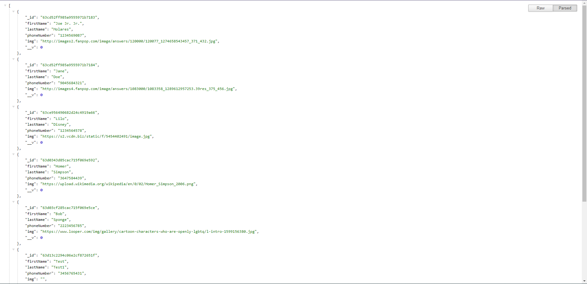
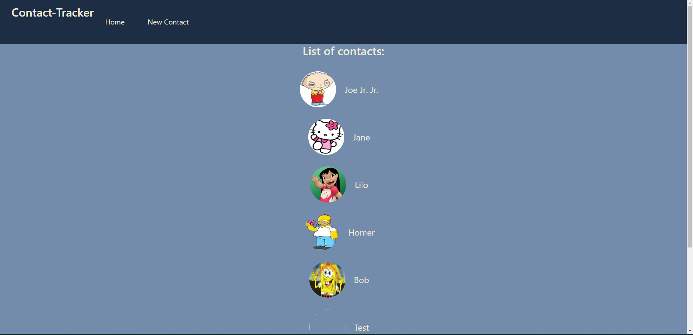
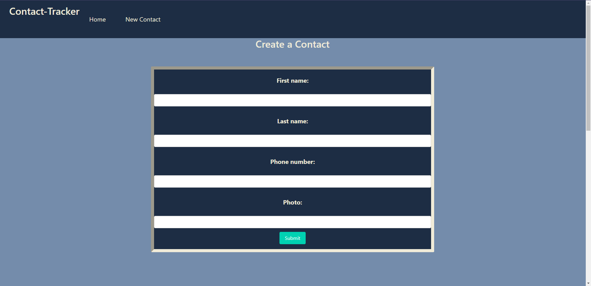
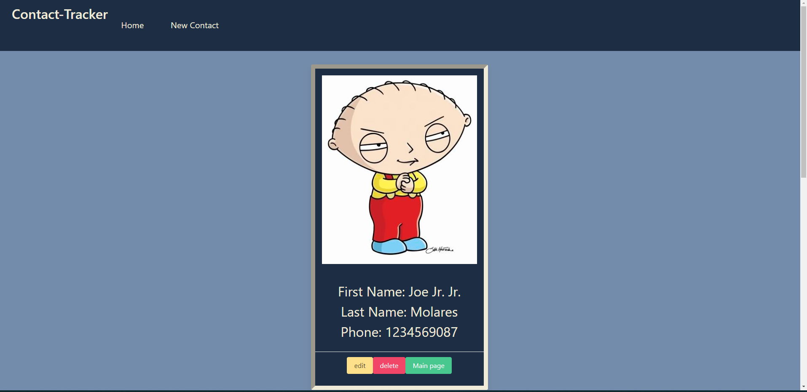
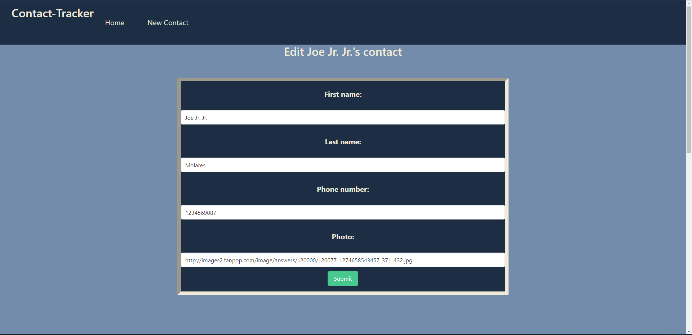

# Contacts Tracker (backend)
This full stack application keeps track of all your contacts' First and last names as well as their phone number and a desired image. 
This app is the back-end of the application, which takes care of everything that happends behind the scene like, connecting to the databse (MongoDB), recieves the call/request from the browser and sends a response out with the information requested. 

## How the app looks from the server side.

## How the app looks from the frontend/UI.
Main page:

New contact page:

Contact information page:

Edit contact page:

## Technologies used
- Express.js
- Node.js
- MongoDB
- Mongoose
- Cors
- Axios
- Dotenv

## Getting Started
**Please keep in mind:** ==both front and back and are deployed on render using the free deployemnt option, so it might take a little to connect and load the information.==

[Server on render](https://contacts-tracker-backend.onrender.com/contacts)

[UI on render](https://contacts-tracker-frontend.onrender.com/)

### Fork and clone this repository:
1. Fork it.
2. Open your text editor of choice.
3. Open terminal and paste the line below.
`git clone https://github.com/OriCruz/contacts-tracker-backend.git`

## Unsolved problems and Future Enhancements
At the moment I can't see any unsolved issues on the backend side of this project, though I would like to change the file structure for it to be a bit cleaner.
Also I would like to implement another model for users to login and display their invidual list of contacts. 

